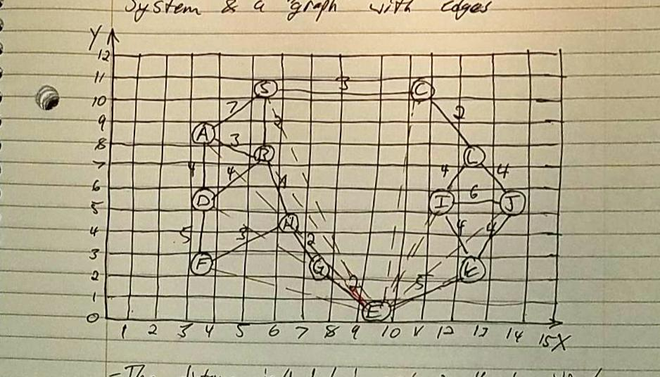

# A-Star Algorithm
Given a starting node and an ending node of a graph, find the shortest distance using the A Star algorithm

# Method
This algorithm uses recursion to check all possible paths, prioritizing the shortest path while it runs. The A-Star method also takes into account the relative position of each node, which allows it to "move" in the correct direction.

# Example

