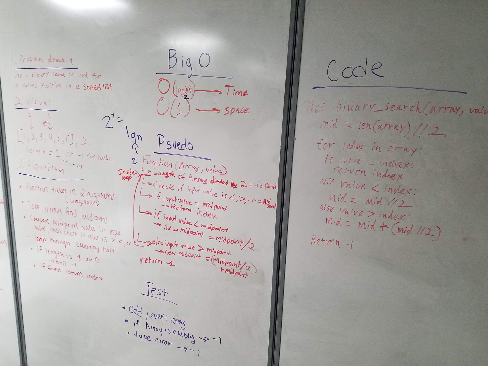

# Insert and shift middle index of array

## Challenge
Write a function that takes in an array and a value. Use the value to search through the array for a matching number, returning the index of the matched number in the array. If no matching number exists, return -1.

## Solution

