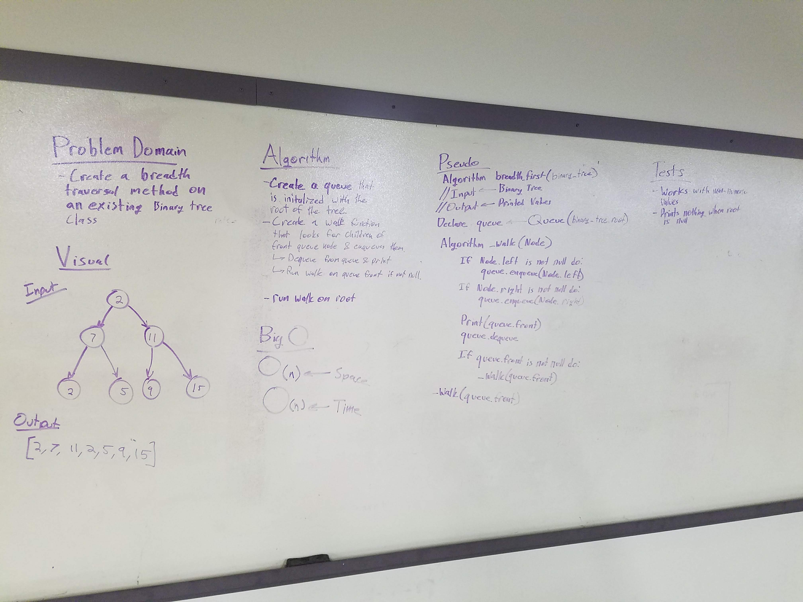

# Breadth First Traversal.
This adds a breadth first travseral class method to the binary tree.

## Challenge
Create a class method that returns the entirity of a binary tree using the breadth first traversal method.

## Solution

