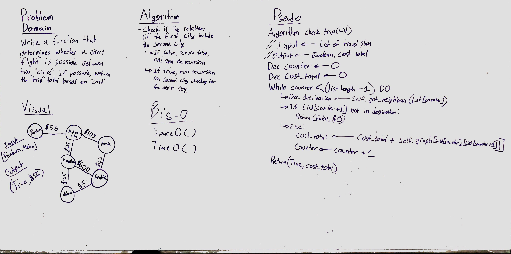

# Get Edges
This uses a class method on an existing graph data structure. The method takes in a list of nodes, and returns wheter that list of nodes can be traversed within the graph.

## Challenge
If the list given to the function is traversable in the graph, the method returns true, and the sum of the weights that were traversed to get to the end point. If the path cannot be traversed directly, the method returns false, and return a sum of 0.

## Solution

