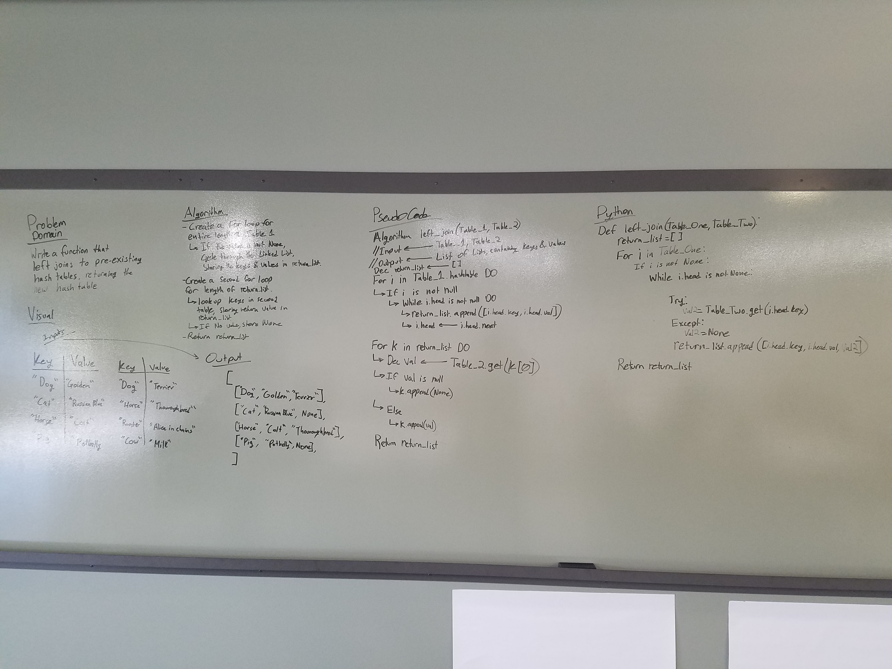

# Hashmap LEFT JOIN
This function utilizes a hash table data structure that I had already built. I copied this file (which uses linked lists to store data within the hash table) into this directory to access it.

## Challenge
This function joins two pre-existing hash tables, using the first hash tables keys as the base, causing it to be a left join. It outputs a list of lists, with each sub list containing the key, the first table value and the second table value. If no second table value exists, None is inserted in the third spot of the sub list.

## Solution

