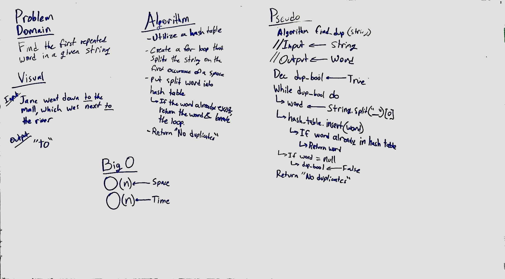

# First repeated word
This challenge utilizes a hash table to check if a word has already been used in the string.

## Challenge
Given a string of unknown length, return the first instance of a repeated word.

## Solution

