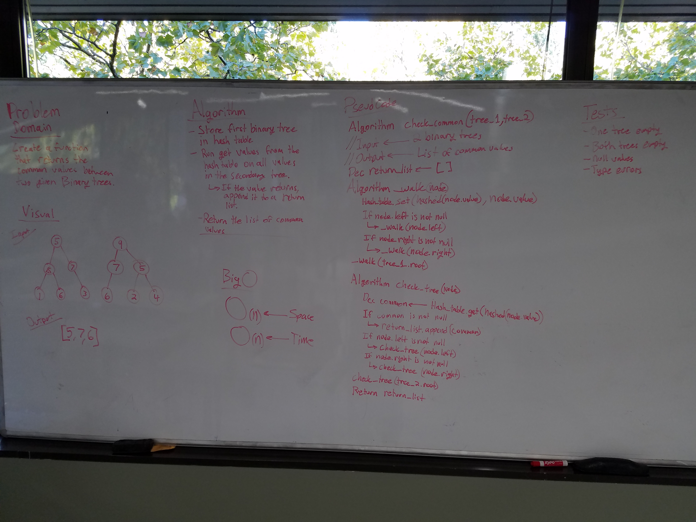

# Intersection of binary trees
This utilizes a premade hash table, as well as a premade binary tree function

## Challenge
Given two pre-populated binary trees, write a function that finds the common values between the two trees. The methodology behind my solution utilizes a hash table, which stores the first tree. The second tree is checked against hash table, and if there are any values that are already in the hash table, they will be appended to a list and returned at the end of the function

## Solution

