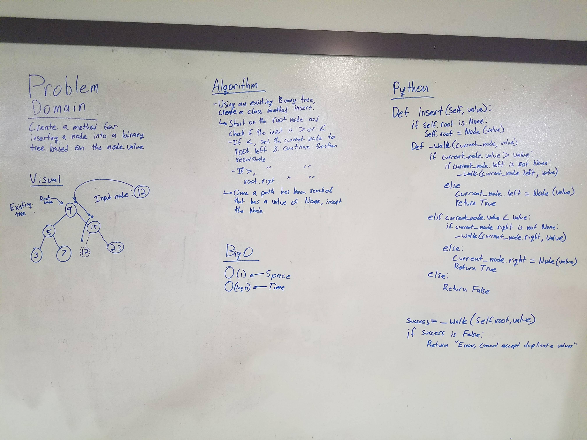

# Binary Tree Search.
This class creates a binary search tree that can be traversed using the class methods of in_order, pre_order, and post_order. All of these methods utilize the various conventional ways of traversing a binary tree

## Challenge
Create a class method that allows the user to input a value into a binary tree, using bigO(log(n)) in terms of time.

## Solution

