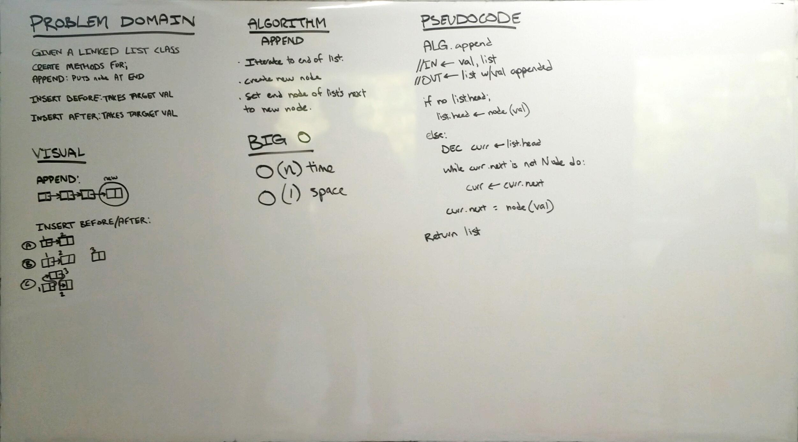
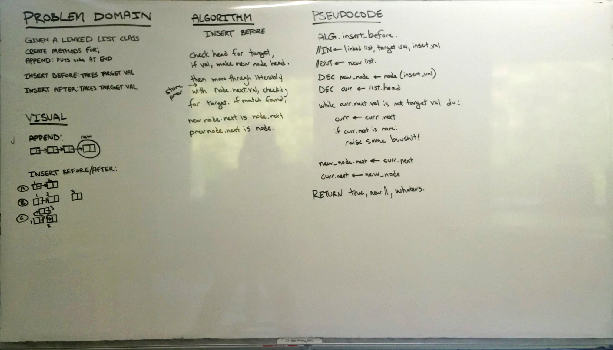
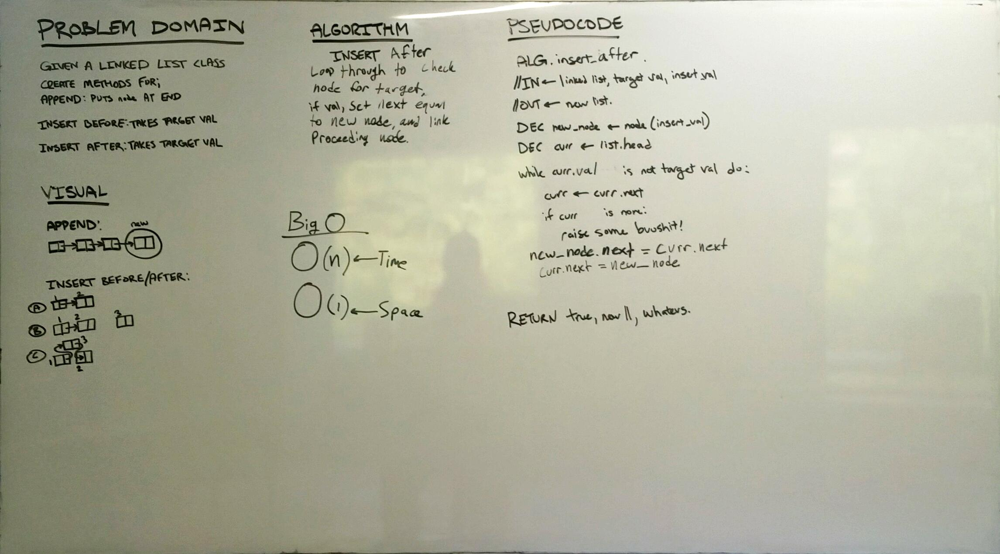

# Linked List Insertions
This challenges utilizes modifying a single linked list.

## Challenge
Add three methods to the linked list class, the first of which appends a node at the end of the list, the second inserts a node before a node with a target value, and the third inserts a node after a node with a target value.

## Solution

