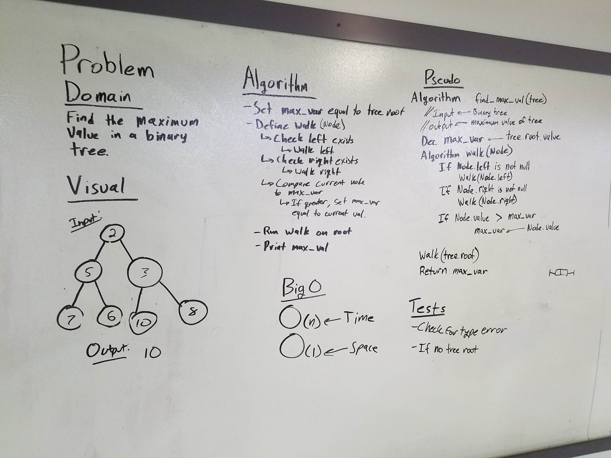

# Find Maximum Value.
This function finds the node with the maximum value in a given (unordered) binary tree.

## Challenge
Create a function that takes in a binary tree, searches the entire tree, then returns the highest value among all tree nodes.

## Solution

