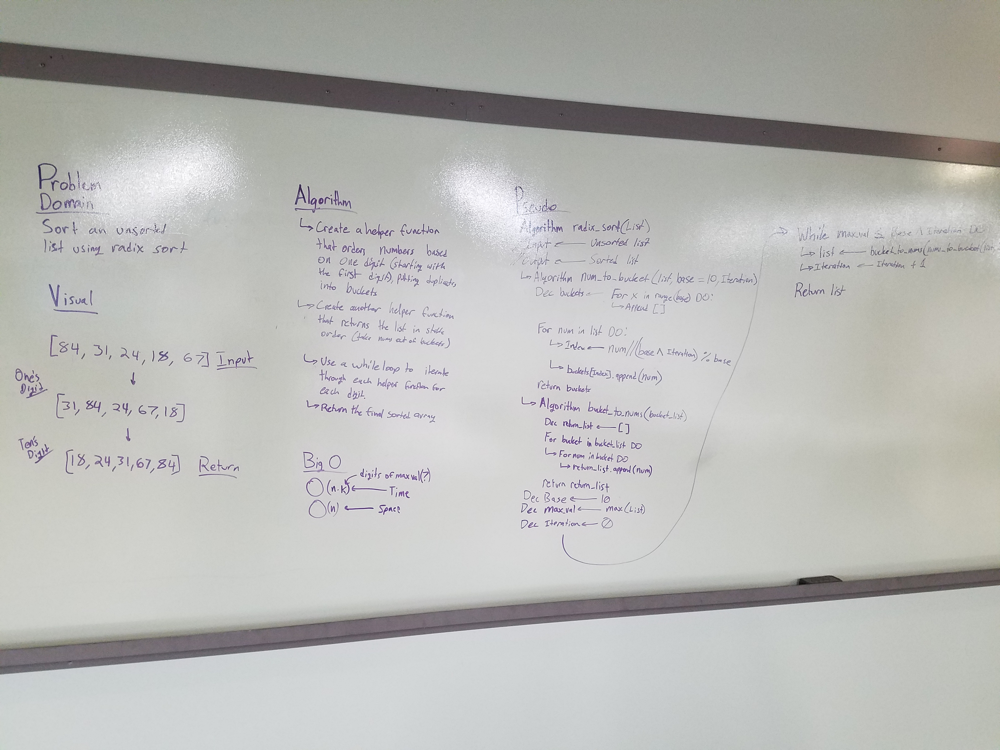

# Radixsort
This algorithm utilizes a radixsort.

## Challenge
This function takes in a unsorted list, and sorts it using a radixsort, which utilizes stablility in sorting single digits of each number.

## Solution

